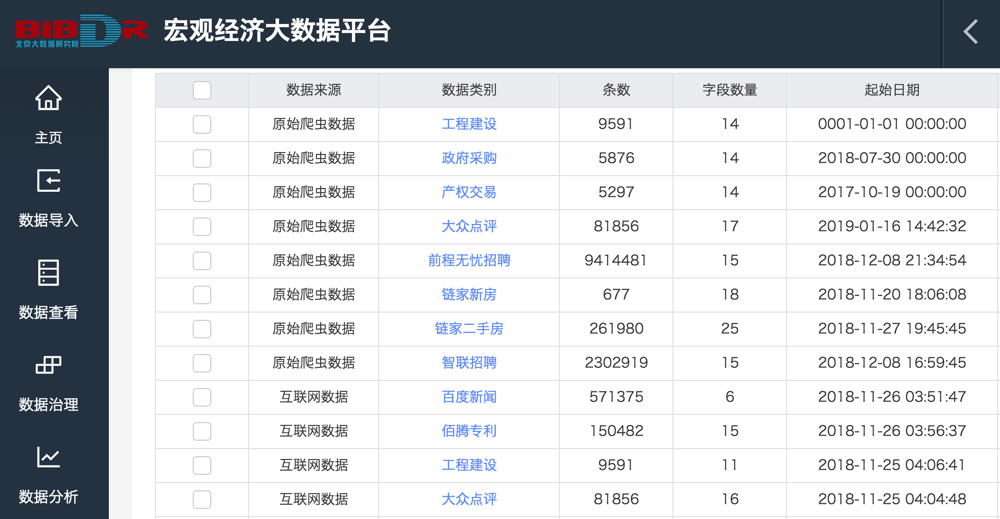

## Final Project Options

### General Rules

- You can choose any **ONE** of the following project options. 

- You can work alone, or in a group of 2.

- The deadline for final project is **9 am July 31** (we need to submit the final scores by Aug 2). Please send your proposal or well-summarized results together with other materials like your code to yuchengy@princeton.edu.

- Only formally enrolled students are expected to work on the final project.

  

### 1. Original Research Proposal using Big Data Collected by BIBDR

- The Beijing Institute of Big Data Research (BIBDR) has launched an "economic big data platform" with quite a lot of alternative big data collected and maintained there. The figure below is part of the data overview for one city. They have generously agreed to provide their data and computing resources for our course projects. 

- The data introduction document, along with the instructions on how to use their platform, and the data application form would be sent to all the enrolled students. 
- After browsing over the data on the platform, groups using the platform for final project would need to submit a data application form to Mr. 孔京  jingk@mail.ustc.edu.cn of BIBDR, and he will prepare the data and put it on the server where you can further analyze the data with softwares like Python, Matlab, R and Stata. The server credentials would be sent to groups who are going to use the data for final projects.
- Key elements of the research proposal:
  - Research question (15'): 
    - Motivation for this work;
    - What is your **exact** research question;
    - Existing work (not a full literature review) and your contribution to the literature.
  - How you would approach this question (30'):
    - What data you are using;
    - Empirical method or theoretical model or computational algorithm;
    - Preliminary results you have got (descriptive statistics, regression results, etc.).
  - Plan for the next steps (5').
- Any questions that arise when using the platform and the server could be addressed to Mr. 孔京 jingk@mail.ustc.edu.cn. You may also suggest what data that you really hope to use (but not available now), so that he could try to get them for you ASAP. 
- As a bonus, BIBDR provide internship opportunities to outstanding students working on this project. 

### 2. Mix Frequency Forecasting with Machine Learning

- (15') Replicate Mixed-Frequency VAR in Schorfheide and Song (2015, JBES) [paper and code link](https://web.sas.upenn.edu/schorf/publications/), especially the results in Figure 2, Figure 4 and Appendix Table C-1. 

- (15') Use the same data as Schorfheide and Song (2015), and use RNN, LSTM or other ML methods (e.g. [FarmSelect](https://cran.r-project.org/web/packages/FarmSelect/index.html)) adjusted for mixed frequency input to predict the same target variables as in Figure 2 and 4, and compare your RMSEs to the RMSEs of MF-VAR. Make sure your results are comparable to theirs. Tune your hyperparameters to get better prediction results. 

- (20') Add more input variables from FRED-QD and FRED-MD ([data link](https://research.stlouisfed.org/econ/mccracken/fred-databases/), [FRED-QD Variable List](https://s3.amazonaws.com/files.fred.stlouisfed.org/fred-md/FRED-QD_appendix.pdf), [FRED-MD Variable List](https://s3.amazonaws.com/files.fred.stlouisfed.org/fred-md/Appendix_Tables_Update.pdf)) and use ML methods to predict the same target variables as in Figure 2. You do not need to implement MF-VAR on your new input data. I expect you could get better results than MF-VAR in general, and will evaluate your work based on your RMSEs. 

- For the extension parts, please present the method and comparison results in detail in the final report. 

  

### 3. Solving Heterogeneous Agent Models with Deep Learning

- (30') Replicate at least two of the methods in Den Haan (2010) and present the results. [project link](http://www.wouterdenhaan.com/datasuite.htm), [paper link](https://www.sciencedirect.com/science/article/pii/S0165188909001298).
- (20'+20') Replicate the work on solving the Krusell-Smith problem with deep neural nets in [this paper](http://papers.nber.org/conf_papers/f126839.pdf).

- For part II, please present the method and results in detail in the final report. As it might be a bit hard, we give 20' extra credit for this part. You may get full credit even if you do not get everything out.

  

### 4. Original Research Proposal on Other Projects

- Some of you may have access to other proprietary big data, so you are also very welcome to use other data resources to propose questions of interest. Please talk to the instructor if you hope to choose this option.
- The requirement for the research proposal is the same as option 1.

